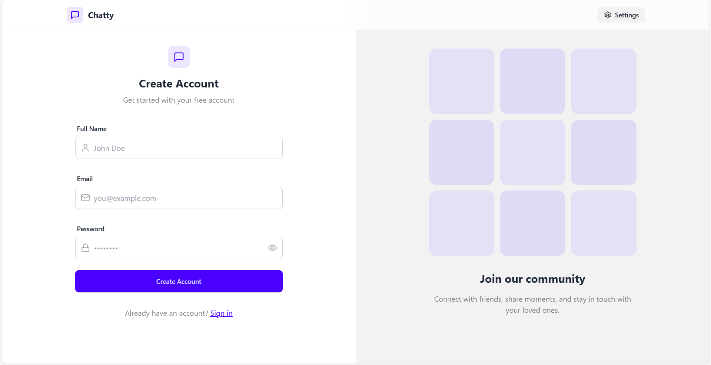
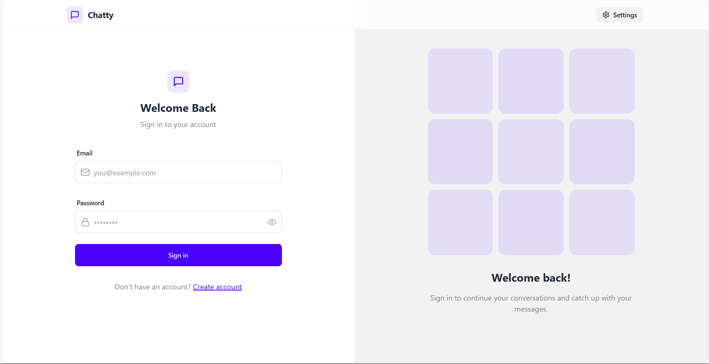
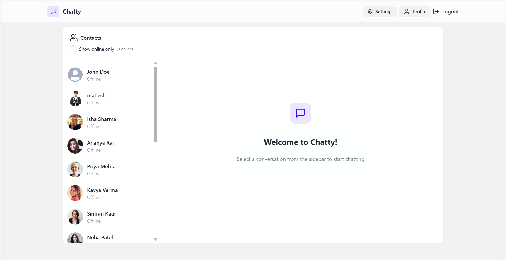

# Full Stack Chat App  

Full Stack Chat App is a real-time messaging application built using the MERN stack. It allows users to register, log in, and engage in seamless, secure, and real-time conversations. Designed for individuals, the app offers features such as real-time updates, user authentication, online status visibility, and an intuitive user interface.

---

## Features  
- **User Authentication**: Secure signup/login using JWT and password hashing.  
- **Real-Time Messaging**: Instant communication with Socket.IO and WebSocket.  
- **Online Status**: View online/offline status of users.  
- **Notifications**: Real-time toast alerts for key events.  
- **Responsive Design**: User-friendly interface built with React and Tailwind CSS.  
- **File Uploads**: Image/file uploads powered by Cloudinary.  
- **Production Ready**: Backend and frontend configured for deployment.  

---

## Demo  
Live Demo: [Full Stack Chat App](https://chat-app-na11.onrender.com/)  

---

## Technologies Used  

### Frontend  
- **React**: Component-based UI library.  
- **React Router**: Handles routing and navigation.  
- **Tailwind CSS**: Utility-first CSS framework for styling.  
- **Socket.IO Client**: Enables real-time communication with the backend.  
- **Axios**: Simplifies HTTP requests to the backend.  
- **Zustand**: Lightweight state management for managing application state.  
- **Lucide Icons**: Clean and scalable icons for UI.  
- **React Hot Toast**: Elegant notifications for user feedback.  

### Backend  
- **Node.js**: JavaScript runtime for building the backend.  
- **Express.js**: Framework for creating RESTful APIs.  
- **Socket.IO**: Real-time bidirectional communication between server and client.  
- **MongoDB**: NoSQL database for storing user and message data.  
- **Mongoose**: ODM library for MongoDB.  
- **JWT**: Secure token-based authentication.  
- **Cloudinary**: Cloud-based file storage and management.  
- **CORS**: Enables secure cross-origin requests.  
- **Dotenv**: Manages environment variables.  
- **Bcrypt.js**: Password hashing for user security.  

---

## Previews  

### Register Page  
  

### Login Page  
  

### Chat Page  
  

---

## Environment Variables  
In the **backend** directory, create a `.env` file with the following variables:  

```env  
MONGODB_URI=your_mongo_connection_string  
PORT=5001  
JWT_SECRET=your_jwt_secret  
CLOUDINARY_CLOUD_NAME=your_cloudinary_cloud_name  
CLOUDINARY_API_KEY=your_cloudinary_api_key  
CLOUDINARY_API_SECRET=your_cloudinary_api_secret  
NODE_ENV=development  
```  

Replace the placeholders with your actual credentials.  

---


## Installation and Setup  

### Prerequisites  
- **Node.js** (v16 or higher)  
- **MongoDB** (running locally or in the cloud)  

### Steps  

1. Clone the repository:  
   ```bash  
   git clone https://github.com/RAJESH2132/chat-app.git  
   cd chat-app  
   ```  

2. Install dependencies:  
   ```bash  
   npm install --prefix backend  
   npm install --prefix frontend  
   ```  

3. Set up environment variables in the `.env` file as described above.  

4. **Run the application**:  

   - **In Development Mode**:  
     Start the backend and frontend servers locally:  
     ```bash  
     # Start the backend  
     npm run dev --prefix backend  

     # Start the frontend  
     npm run dev --prefix frontend  
     ```  

   - **In Production Mode**:  
     1. Build the frontend:  
        ```bash  
        npm run build --prefix frontend  
        ```  
     2. Start the backend server with the production configuration:  
        ```bash  
        npm run start --prefix backend  
        ```  

5. Access the application locally:  
   - **Frontend**: [http://localhost:5173](http://localhost:5173)  
   - **Backend API**: [http://localhost:5001](http://localhost:5001)  

